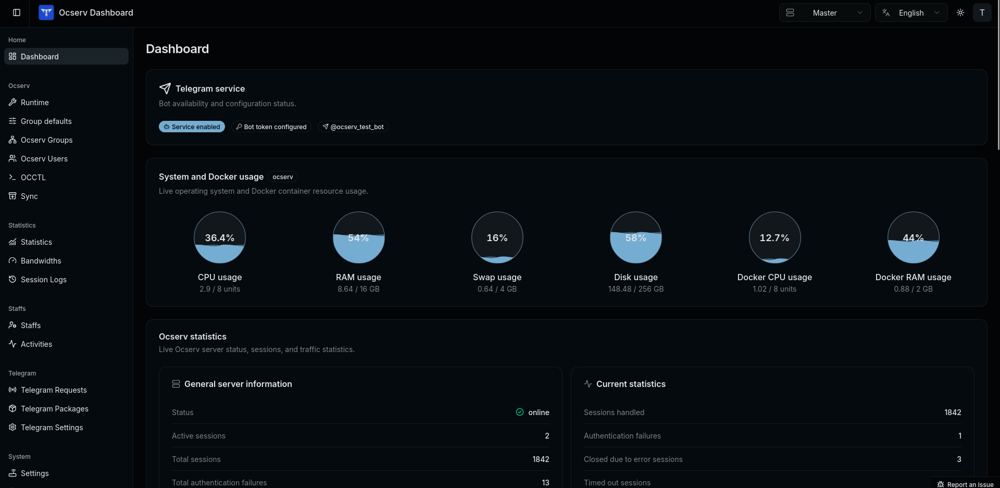
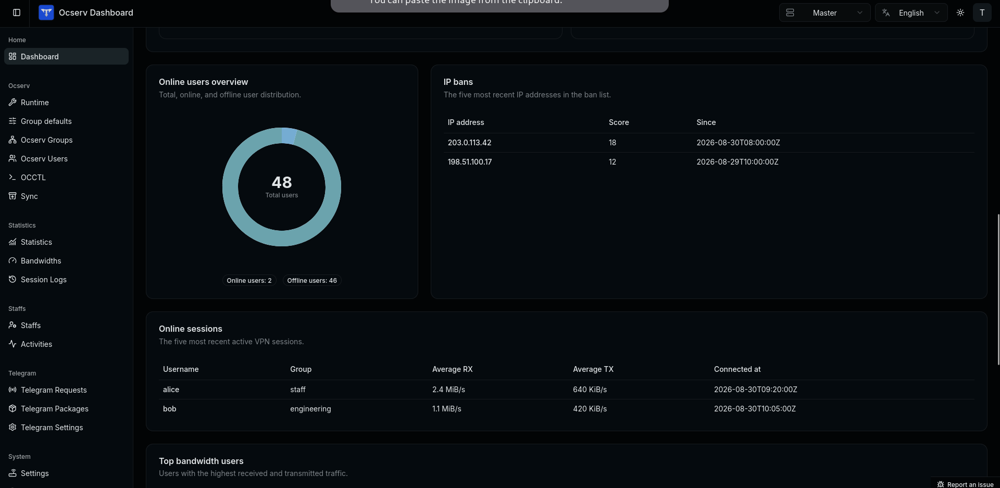
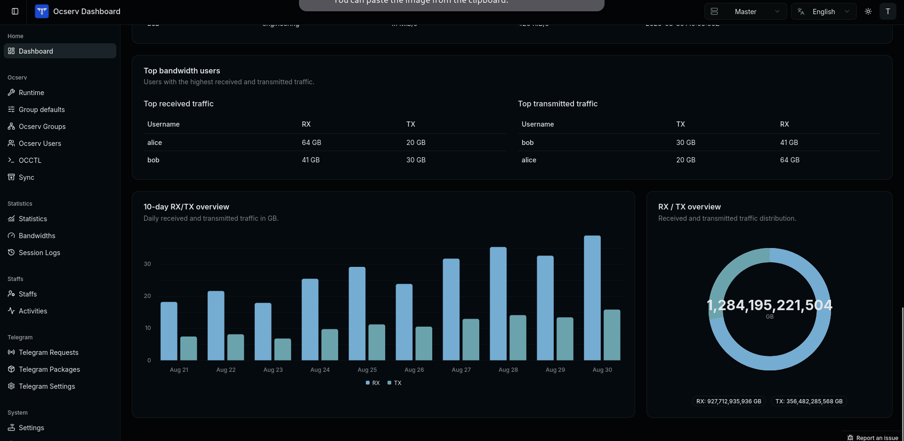
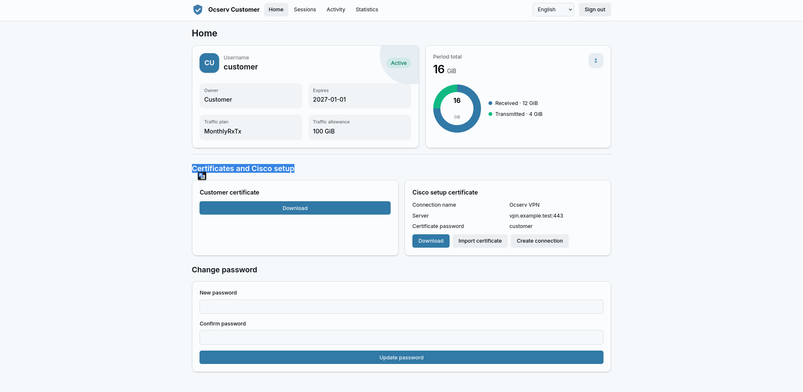

# Ocserv Dashboard

Ocserv Dashboard is a self-hosted control plane for an [OpenConnect Server (ocserv)](https://ocserv.openconnect-vpn.net/). It packages the VPN server, a Go backend, PostgreSQL, nginx, and the web applications into one deployable service, so you can provision and operate a VPN service from a browser.

> **Production support:** Linux hosts running Docker/Compose or a native Debian/Ubuntu systemd installation. The recommended installation path is the included guided installer.

<p align="center">
  
  <br>
  
  <br>
  
</p>

## ✨ What it provides

- 👥 Dashboard-driven management of ocserv users, groups, passwords, certificates, expiry, quotas, and sessions.
- 📊 Live server and traffic statistics, usage accounting, activity history, and ocserv log access.
- 🛡️ Role-based staff administration, with ownership boundaries for staff-created users and groups.
- 🙋 Customer self-service portal for account details, usage, certificates, sessions, and passwords.
- 🤖 Optional Telegram bot for customer self-service, notifications, payments, packages, and requests.
- ⚙️ Built-in database migrations, initial-superadmin provisioning, health checks, and graceful process supervision.
- 🌐 Master and agent node modes for distributed deployments.

## 🙋 Customer self-service portal

The optional customer portal lets each VPN user sign in with their Ocserv username and password. From a single Home page, customers can view account status, expiry, traffic allowance, received/transmitted usage, certificates, Cisco Secure Client setup details, and change their password. They can also review active sessions and activity history, view daily bandwidth statistics, and disconnect or terminate their own sessions.

<p align="center">
  
</p>

### Enable or disable the portal

The portal is enabled by default on a master/full node:

```env
CUSTOMER_API_ENABLED=true
```

Set it to `false` to disable customer API routes and the `/customer/` UI. The value must match the Docker build argument in `compose.production.yml`; rebuild and redeploy after changing it:

```bash
sudo docker compose -f compose.production.yml up --build -d
```

For the guided installer, edit `CUSTOMER_API_ENABLED` in the environment step or update `.env` before rerunning the installer. Agent nodes do not serve the customer portal.

### Customer access

Customers access the portal at:

```text
https://YOUR_DOMAIN_OR_IP:3000/customer/
```

Replace `3000` with your configured `WEB_PORT`. The portal is served over the same TLS endpoint as the admin dashboard.

## 📋 Requirements

- A Linux host with Docker Engine and Docker Compose, or Debian/Ubuntu for native systemd installation.
- `/dev/net/tun` available on the host.
- Ability to grant the container `NET_ADMIN` and read the Docker socket.
- For a full node: public `443/tcp`, `443/udp`, and `3000/tcp` available. Agent nodes use `8080/tcp` for their API.
- A DNS record and a valid TLS certificate strategy before exposing the service publicly.

## 🚀 Install

The installer fetches the latest tagged release, then guides you through deployment type (Docker or systemd), node mode (master or agent), and environment configuration.

```bash
curl -fsSLO https://raw.githubusercontent.com/mmtaee/ocserv-dashboard/main/install.sh
bash install.sh
```

Or, from a repository checkout:

```bash
./setup.sh
```

The installer creates `.env` only if it does not already exist, generates initial secrets, and supports upgrades. For an unattended installation, select both options explicitly:

```bash
./setup.sh --deployment docker --node master --yes
# or: ./setup.sh --deployment systemd --node master --yes
```

Use `--node agent` for an agent node. The installer sets `AGENT_NODE=true` for agents and `false` for masters. To upgrade an installed deployment, run:

```bash
./setup.sh --update
```

After installation, open `https://YOUR_DOMAIN_OR_IP:3000/` and sign in with the superadmin credentials configured in `.env` (or use your configured `WEB_PORT`).

## 📦 Pre-built Docker images

Every pushed release tag (`v*`) publishes multi-architecture images for `linux/amd64` and `linux/arm64` to Docker Hub and GitHub Container Registry. Docker Hub is the default in the examples below; GHCR is an equivalent alternative.

```bash
mkdir ocserv-dashboard && cd ocserv-dashboard
docker pull mmtaee/ocserv-dashboard:v1.0.0
# Alternative: docker pull ghcr.io/mmtaee/ocserv-dashboard:v1.0.0
```

Create `.env`, replace every placeholder, and protect the file:

```env
HOST="vpn.example.com"
ETH="eth0"
SECRET_KEY="paste-a-64-character-random-hex-value-here"
POSTGRES_PASSWORD="replace-with-a-strong-database-password"
SUPERADMIN_USERNAME="admin"
SUPERADMIN_PASSWORD="replace-with-a-strong-superadmin-password"

AGENT_NODE=false
OCSERV_PORT=443
WEB_PORT=3000
OC_NET="172.16.24.0/24"
OCSERV_DNS="1.1.1.1"
SSL_CN="vpn.example.com"
SSL_ORG="ocserv-dashboard"
TELEGRAM_BOT_ENABLED=false
CUSTOMER_API_ENABLED=true
```

Generate the `SECRET_KEY` value with the following command, paste its output into `.env`, then run `chmod 600 .env`:

```bash
openssl rand -hex 32
```

Create `compose.yml` alongside it:

```yaml
services:
  ocserv:
    container_name: ocserv
    image: mmtaee/ocserv-dashboard:v1.0.0
    env_file: .env
    environment:
      HOST_PROC: /host/proc
      HOST_SYS: /host/sys
      POSTGRES_HOST: 127.0.0.1
      TELEGRAM_RECEIPTS_DIR: /opt/ocserv_dashboard/uploads/receipts
    cap_add: [NET_ADMIN]
    sysctls:
      net.ipv4.ip_forward: "1"
    devices:
      - /dev/net/tun:/dev/net/tun
    volumes:
      - /var/run/docker.sock:/var/run/docker.sock:ro
      - /proc:/host/proc:ro
      - /sys:/host/sys:ro
      - ./data/ocserv:/etc/ocserv
      - ./data/postgresql18:/var/lib/postgresql
      - ./data/cron_journal:/app/cron_journal
      - ./data/telegram_receipts:/opt/ocserv_dashboard/uploads/receipts
    ports:
      - "${OCSERV_PORT:-443}:${OCSERV_PORT:-443}/tcp"
      - "${OCSERV_PORT:-443}:${OCSERV_PORT:-443}/udp"
      - "${WEB_PORT:-3000}:${WEB_PORT:-3000}"
    restart: unless-stopped
```

Create the persistent directories and start the release image:

```bash
mkdir -p data/ocserv data/postgresql18 data/cron_journal data/telegram_receipts
sudo docker compose up -d
sudo docker compose logs -f ocserv
```

### Run directly with Docker

If you do not use Compose, run the same release image with the `.env` file and required host mounts:

```bash
sudo docker run -d \
  --name ocserv \
  --env-file .env \
  -e HOST_PROC=/host/proc \
  -e HOST_SYS=/host/sys \
  -e POSTGRES_HOST=127.0.0.1 \
  -e TELEGRAM_RECEIPTS_DIR=/opt/ocserv_dashboard/uploads/receipts \
  --cap-add=NET_ADMIN \
  --sysctl net.ipv4.ip_forward=1 \
  --device /dev/net/tun:/dev/net/tun \
  -v /var/run/docker.sock:/var/run/docker.sock:ro \
  -v /proc:/host/proc:ro \
  -v /sys:/host/sys:ro \
  -v "$PWD/data/ocserv:/etc/ocserv" \
  -v "$PWD/data/postgresql18:/var/lib/postgresql" \
  -v "$PWD/data/cron_journal:/app/cron_journal" \
  -v "$PWD/data/telegram_receipts:/opt/ocserv_dashboard/uploads/receipts" \
  -p 443:443/tcp \
  -p 443:443/udp \
  -p 3000:3000 \
  --restart unless-stopped \
  mmtaee/ocserv-dashboard:v1.0.0
```

Use `sudo docker logs -f ocserv` to follow startup. If you change `OCSERV_PORT` or `WEB_PORT` in `.env`, change the matching `-p` mappings too.

Open `https://vpn.example.com:3000/` after initialization. `ETH` must be the host interface that carries VPN traffic; use `ip route get 1.1.1.1` to identify it. The Docker socket mount is required for application features that read ocserv logs, and grants the container significant host access.

Stable tags such as `v1.0.0` also update `mmtaee/ocserv-dashboard:latest` and `ghcr.io/mmtaee/ocserv-dashboard:latest`; prereleases such as `v1.0.0-beta.1` do not. Initially, GitHub Container Registry packages may be private. A repository owner can open the package page, select **Package settings**, then **Change visibility** and choose **Public**. Public GHCR images can be pulled without signing in.

## 🛰️ Agent nodes

An agent node is a separate ocserv server managed alongside a master deployment. It serves VPN traffic on its own `443/tcp` and `443/udp` endpoints and exposes its backend API on `8080/tcp`; it does not serve the admin dashboard, customer portal, nginx, or Telegram bot.

The published Docker Hub and GHCR images are full-node images. Build agent nodes through the installer, which builds the image with `AGENT_NODE=true`:

```bash
git clone --branch v1.0.0 --depth 1 https://github.com/mmtaee/ocserv-dashboard.git
cd ocserv-dashboard
cp .env.example .env
./setup.sh --deployment docker --node agent --yes
```

Before running the installer, set at least the following values in the agent's `.env` file. Generate a different `SECRET_KEY` and database password for every agent; do not reuse the master's secrets.

```env
HOST="agent-1.example.com"
ETH="eth0"
AGENT_NODE=true
SECRET_KEY="paste-a-64-character-random-hex-value-here"
POSTGRES_PASSWORD="replace-with-a-strong-database-password"
SUPERADMIN_USERNAME="admin"
SUPERADMIN_PASSWORD="replace-with-a-strong-superadmin-password"
CUSTOMER_API_ENABLED=false
TELEGRAM_BOT_ENABLED=false
```

Allow VPN traffic to the agent on `443/tcp` and `443/udp`. Restrict `8080/tcp` to the master server or an administrator network: the agent API is HTTP, not the public dashboard endpoint.

### Register an agent with the master

After the agent starts, create its local registration token and store it securely:

```bash
docker exec ocserv backend agent-token create
```

The command returns JSON containing `token`. In the master dashboard, open **System Settings** → **Ocserv agents**, then create an entry with the agent name, its public IP address or fully qualified domain name, port `8080`, and that token. Only superadmins can manage agent entries.

Use `docker exec ocserv backend agent-token get` to view the current token. To rotate it, run `docker exec ocserv backend agent-token renew`, then immediately replace the token in the corresponding master entry. Agent nodes remain independent VPN and database deployments; registration does not copy users, certificates, or configuration from the master.

## 🐳 Production Docker deployment

Use the installer above where possible. The following is the supported manual Docker layout for operators who manage their own Compose file.

1. Create persistent host directories:

   ```bash
   sudo mkdir -p \
     /opt/ocserv_dashboard/docker_volumes/postgresql18 \
     /opt/ocserv_dashboard/docker_volumes/ocserv \
     /opt/ocserv_dashboard/docker_volumes/cron_journal \
     /opt/ocserv_dashboard/docker_volumes/telegram_receipts
   ```

2. Create and secure the environment file:

   ```bash
   cp .env.example .env
   chmod 600 .env
   openssl rand -hex 32
   ```

   Set the generated value as `SECRET_KEY` and set strong values for at least:

   ```env
   AGENT_NODE=false
   SECRET_KEY="replace-with-a-random-secret"
   POSTGRES_PASSWORD="replace-with-a-strong-database-password"
   SUPERADMIN_USERNAME="admin"
   SUPERADMIN_PASSWORD="replace-with-a-strong-superadmin-password"
   ```

   Also review `HOST`, `ETH`, `OC_NET`, DNS settings, certificate settings, and the optional `CUSTOMER_API_ENABLED` and `TELEGRAM_BOT_ENABLED` flags. Do not commit `.env`.

3. Save this as `compose.production.yml` in the repository root:

   ```yaml
   services:
     ocserv:
       container_name: ocserv
       image: ocserv-dashboard:latest
       build:
         context: .
         dockerfile: deploy/docker/Dockerfile
         args:
           AGENT_NODE: ${AGENT_NODE:-false}
           CUSTOMER_API_ENABLED: ${CUSTOMER_API_ENABLED:-true}
           TELEGRAM_BOT_ENABLED: ${TELEGRAM_BOT_ENABLED:-true}
       env_file: .env
       environment:
         HOST_PROC: /host/proc
         HOST_SYS: /host/sys
         POSTGRES_HOST: 127.0.0.1
         TELEGRAM_RECEIPTS_DIR: /opt/ocserv_dashboard/uploads/receipts
       cap_add: [NET_ADMIN]
       sysctls:
         net.ipv4.ip_forward: "1"
       devices:
         - /dev/net/tun:/dev/net/tun
       volumes:
         - /var/run/docker.sock:/var/run/docker.sock:ro
         - /proc:/host/proc:ro
         - /sys:/host/sys:ro
         - /opt/ocserv_dashboard/docker_volumes/ocserv:/etc/ocserv
         - /opt/ocserv_dashboard/docker_volumes/telegram_receipts:/opt/ocserv_dashboard/uploads/receipts
         - /opt/ocserv_dashboard/docker_volumes/postgresql18:/var/lib/postgresql
         - /opt/ocserv_dashboard/docker_volumes/cron_journal:/app/cron_journal
       ports:
         - "${OCSERV_PORT:-443}:${OCSERV_PORT:-443}/tcp"
         - "${OCSERV_PORT:-443}:${OCSERV_PORT:-443}/udp"
         - "${WEB_PORT:-3000}:${WEB_PORT:-3000}"
       restart: unless-stopped
       healthcheck:
         test: [CMD, curl, -fsS, http://127.0.0.1/health]
         interval: 10s
         timeout: 5s
         retries: 5
         start_period: 30s
   ```

4. Build and start it, then follow the first-start logs until migrations finish:

   ```bash
   sudo docker compose -f compose.production.yml up --build -d
   sudo docker compose -f compose.production.yml logs -f ocserv
   ```

The container must remain named `ocserv`: the worker reads ocserv logs through the Docker API. PostgreSQL 18 data must be mounted at `/var/lib/postgresql`; do not use the pre-18 `/var/lib/postgresql/data` location.

## 🧰 Operations

```bash
# Check service health from the host
curl -fsS http://127.0.0.1/health

# Follow logs
sudo docker compose -f compose.production.yml logs -f ocserv

# Stop services without deleting persistent host data
sudo docker compose -f compose.production.yml down
```

The API reference is available at `/swagger/index.html` on the backend endpoint. Keep it private or protected in production.

### 🔑 Agent token management

Agent-token commands are local-only and reject master mode:

```bash
# Docker agent node
docker exec ocserv backend agent-token create
docker exec ocserv backend agent-token get
docker exec ocserv backend agent-token renew
docker exec ocserv backend agent-token remove
```

For a systemd agent installation, run the same command through `/opt/ocserv-dashboard/backend`.

## 🧑‍💻 Development

Development uses a backend-only Docker image while the admin and customer applications run from their local development servers:

```bash
./scripts/dev.sh
```

The script creates repository-local state in `.volume/`, starts the development stack, and follows logs. Useful overrides include:

```bash
FOLLOW_LOGS=false ./scripts/dev.sh
NO_CACHE=true ./scripts/dev.sh
DEV_API_PORT=9080 DEV_POSTGRES_PORT=55435 ./scripts/dev.sh
OCSERV_DEBUG=3 ./scripts/dev.sh
```

Development defaults to verbose ocserv logs. Do not run the development and production examples simultaneously with the same container name or ports.

## 🌍 Contributing to translations (i18n)

Translations are welcome. The supported locale codes are `en`, `it`, `zh-cn`, `zh-tw`, `ru`, `fa`, and `ar`.

### Improve an existing language

Update the matching existing-language entries in the following places, keeping every key and interpolation placeholder (for example, `{page}` or `%s`) unchanged:

- Admin dashboard: `web/admin/src/locales/`
- Customer portal: `web/customer/src/locales/index.ts`
- Telegram bot conversation: `backend/internal/usecase/telegram_bot/i18n/locales/<code>.json`
- Telegram notifications: `backend/internal/usecase/admin_api/telegram/i18n/default.json`
- Telegram BotFather commands and descriptions: `backend/internal/services/telegram_bot/bot/metadata/locales.json`

### Add a new language

Use a lowercase BCP 47-style code (for example, `es` or `pt-br`) and add it consistently across the dashboard, customer portal, and Telegram services:

1. Add the code to `backend/internal/models/enums.go` and its validation switch, then add its display label to `backend/internal/models/telegram_languages.go`. Add it to the RTL switch there when applicable.
2. Create `web/admin/src/locales/<code>.ts` from `en.ts`. Import it and add its complete entry to the `messages` object in `web/admin/src/locales/index.ts`; each shared `*Messages` catalog in that file also needs a complete translation for the new code.
3. Copy the English entry in `web/customer/src/locales/index.ts` into the `translations` object, and add `["<code>", "Language name"]` to `localeOptions`. Mark it RTL in `isRtlLocale` if needed.
4. Copy `backend/internal/usecase/telegram_bot/i18n/locales/en.json` to `<code>.json` and translate every value.
5. Add the language object to `backend/internal/usecase/admin_api/telegram/i18n/default.json` and add BotFather metadata for the code in `backend/internal/services/telegram_bot/bot/metadata/locales.json`.
6. Add `<code>:Language name` to `VITE_I18N_LANGUAGES` in both `deploy/docker/Dockerfile` build stages and both UI builds in `deploy/systemd/install-common.sh`.

For a new translation key, update all supported language catalogs in the same change. Build and type-check both web applications before opening a pull request:

```bash
(cd web/admin && yarn type-check && yarn build)
(cd web/customer && yarn type-check && yarn build)
```

## 🔐 Security and backup notes

- Treat `.env`, the PostgreSQL volume, `/etc/ocserv`, certificate material, and Telegram receipts as sensitive data.
- Back up the persistent directories before upgrades and test restores regularly.
- Restrict Docker socket access; mounting it grants the container powerful control over the Docker host.
- Allow only the required firewall ports and protect administrative access with strong credentials.
- Legacy PostgreSQL 17 data at `/opt/ocserv_dashboard/docker_volumes/pg_db` is not mounted by the PostgreSQL 18 deployment. Migrate it explicitly with `pg_upgrade`; never copy PostgreSQL 17 files directly into the PostgreSQL 18 directory.

## 📄 License

This project is licensed under the [MIT License](LICENSE).

## ⭐ Star History

[](https://www.star-history.com/#mmtaee/ocserv-dashboard&Date)
